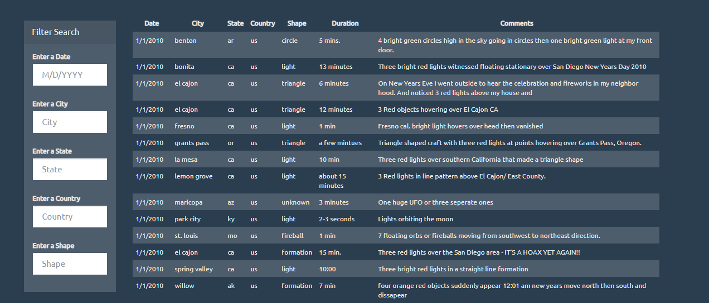

# UFO Sightings Data

# Dependencies
  * Javascript
  * D3.js
  * HTML
  * CSS
  * Bootstrap

# Prompt
Using the provided dataset create a webpage of ufo sightings that can be filtered and deploy it to GitHub pages.

# Process

1. Initial Setup and HTML

    The focus of this project is creating a searchable table using D3.js. Starter code for the design of the page has been provided. The starter CSS and bootsrap references are called in the head and body as necessary. The data for the page lives as a var in another javascript file. To make this data accessible a script tag is used to reference it. The script tag for the data file needs to be before the reference to `app.js` file otherwise the data will not be available.
    ```
    <script src="static/js/data.js"></script>
    <script src="UFO-D3/app.js"></script>
    </body>
    ```
    
    An `index.html` file will house all the page elements. Bootstrap is used to organize these elements. On the left side of the page is a bootstrap form. This form is coded to filter the table based on any combination of the following:
    * Date
    * City
    * State
    * Country
    * Shape

    The html code for this form consists of a form container that holds all of the categories as list items.
    ```
     <div class="panel-heading">Filter Search</div>
              <div class="panel-body">
                <form id = "form">
                  <div class="form-group">
                    <ul class="list-group" id="filters">
                      <li class="filter list-group-item">
                        <label for="date">Enter a Date</label>
                        <input class="form-control" id="datetime" type="text" placeholder="M/D/YYYY">
                      </li>
    ```
    
    The table to the right of the form is where the raw data will live. Each column is named using a thead tag with duration and comments as additional metadata. 
    
    
    
2. Populating the table

    To dynamically create the table a user defined function is needed. First a link to the data is setup using a variable. 
    ```
    const tableData = data;
    ```
    Next, the logic within the function selects the id for tbody and all the necessary tr's. D3 is using a virtual selection for the tr's since they don't exist yet. 
    ```
    selection = d3.select("#ufo-tbody").selectAll("tr").data(d)
    ```
    This function is essentially creating a list, to ensure only the needed tr's are included `selection.exit().remove();` is added before the rest of the code. Without this line rows from a previous filterings could end up in the virtual selection. Finally to create the table several functions are chained together. Each tr from the selection is appended and merged. `html(addData)` is used to loop the selection and apply all the associated metadata.
    ```
    selection
    .enter()
    .append("tr")
    .merge(selection)
    .html(addData);
    function addData(row, i){
        return `<td> ${row.datetime} </td>
        <td> ${row.city} </td>
        <td> ${row.state} </td>
        <td> ${row.country} </td>
        <td> ${row.shape} </td>
        <td> ${row.durationMinutes} </td>
        <td> ${row.comments} </td>
        `;
    }
    ```
    Once the logic function is written is can be called using the data variable that was set up in the first step.
    
3. Filtering the table

    The filter the table two user defined functions are needed. The first function will be used search the data based on what a user inputs into the form. A filters object is created to hold the user inputs. `Object.entrires()` is used create a key value pair for the filters. The key will be a category from the form (ex: Date) and the value will be the user input. Since more than one filter can be used a `forEach()` loop is needed. Using the fat arrow the key-value pairs are passed to a filteredData variable. This variable is used to check the key for the current row against the value. If they are exactly equal it stays in the variable. Once the `forEach()` loop completes the results are used within `buildTable()` to display the results on the page.
    ```
    Object.entries(filters).forEach(([key, value]) => {
      filteredData = filteredData.filter(row => row[key] === value);
    });
    ```
    
    The make the form reusable another function is needed. This function will track any changes to the fields and update the filters object as necessary. A few variables are needed for tracking changes.
    ```
    var changedElement = d3.select(this).select("input");
    var elementValue = changedElement.property("value");
    var filterId = changedElement.attr("id");
    ```
    D3.select is used to keep track of the inputs. If any changes occur it will alter the value in the form. Each of the changes will to a specific category and filterId will help keep track of that. With all the trackers set up an if-else statement will determine if an element needs to be added or removed from the filters object.
    ```
    if (elementValue) {
    filters[filterId] = elementValue;
    }
    else {
    delete filters[filterId];
    }
    ```
    filterTable() is then called to update the table. A change event is needed to fire `updateFilters()`. D3 can handle that.
    ```
    d3.selectAll(".filter").on("change", updateFilters);
    ```
    
# To see the code in action visit https://npvoravong.github.io/ufo/
